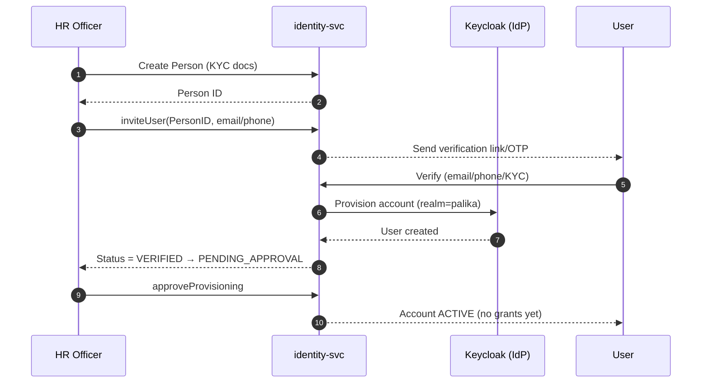
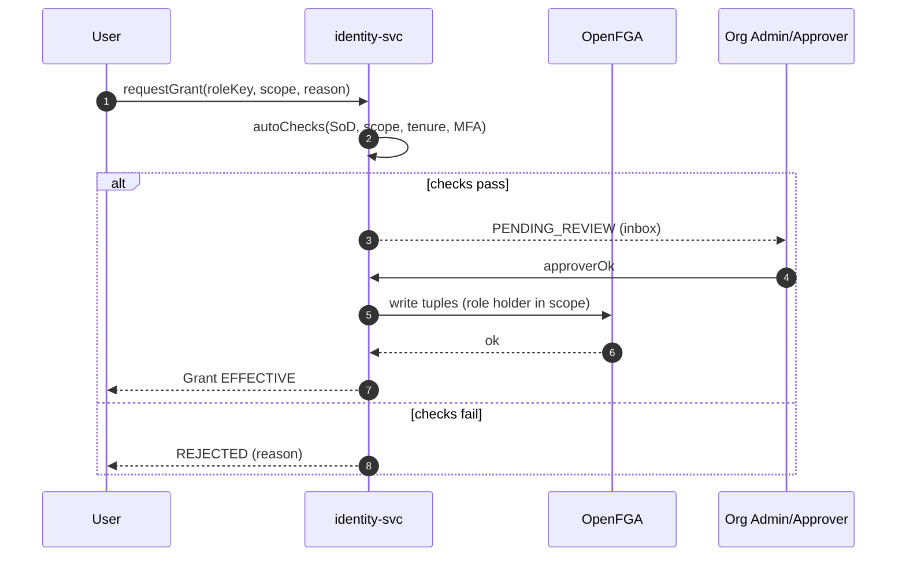
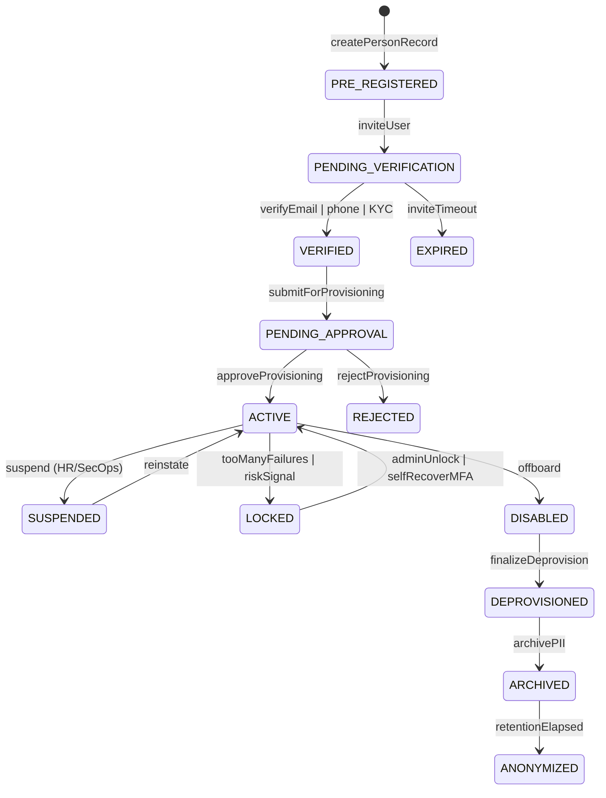
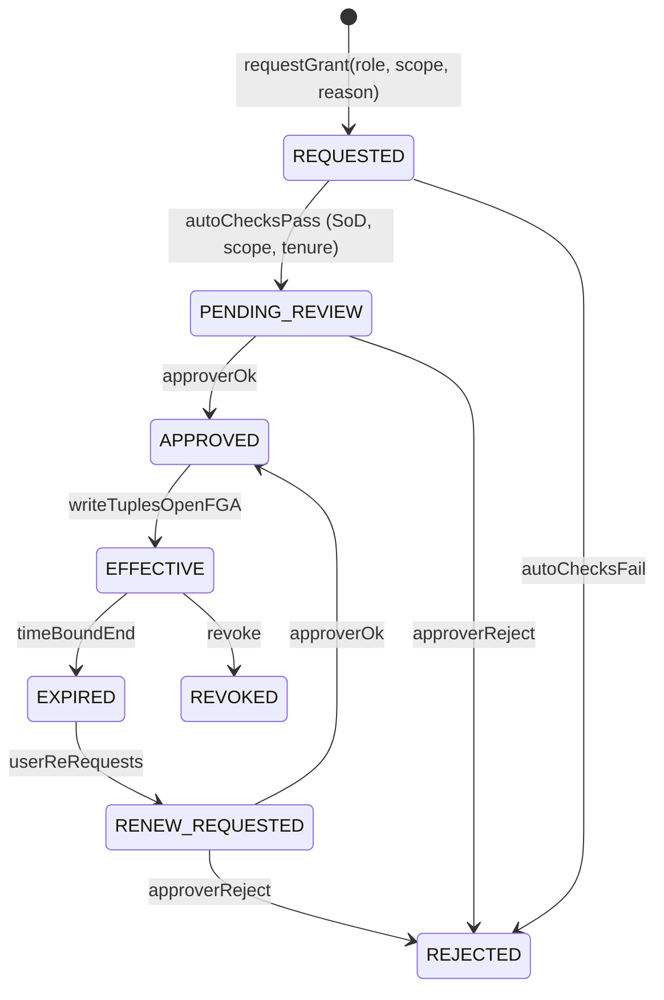
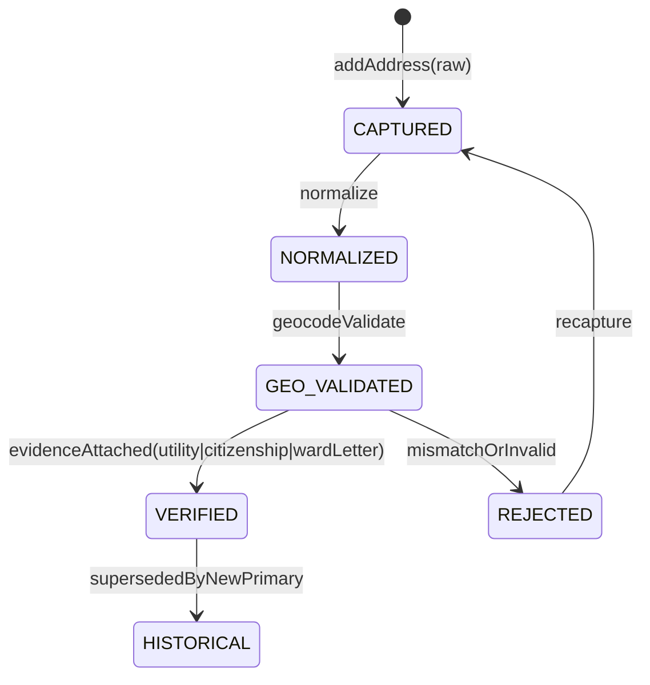

# **Identity & Access Lifecycle Specification**

**Document Version:** 0.9 (First Draft)
**Owner:** Platform Engineering – e-Palika Core
**Last Updated:** 2025-10-05

---

## 1. Purpose

This document defines the **end-to-end identity & access lifecycle** for the e-Palika platform. It standardizes entities, states, transitions, authorization semantics (with **OpenFGA**), and integration contracts so that users, roles, addresses, and permissions remain **dynamic, generic, and auditable** across all Palika services (Chalani, Darta, iJalas, Sifaris, etc.).

---

## 2. Scope

Applies to:

* **Identity microservice (`identity-svc`)** — source of truth for **Person/User**, **Org Units**, **Roles**, **Grants**, **Addresses**, **Credentials**, **Groups**, **Delegations**.
* **AuthN** (Keycloak) & **AuthZ** (OpenFGA) integration.
* **GraphQL Gateway** (read/write identities, request/approve grants) and **gRPC** between services.
* **Event streams** for provisioning, HR sync, audit, and recertification.

Out of scope: IDP implementation details inside Keycloak (handled by Keycloak admins) — but lifecycles below drive Keycloak config via automation.

---

## 3. Terminology

| Term           | Definition                                                                                                 |
| -------------- | ---------------------------------------------------------------------------------------------------------- |
| **Person**     | A real individual (citizen or staff). Immutable profile core.                                              |
| **User**       | A login-enabled account linked to a Person.                                                                |
| **OrgUnit**    | Palika ➜ Ward ➜ Section hierarchy (multi-tenant).                                                          |
| **Role**       | Named capability set (e.g., `ward_clerk`, `caO`, `reviewer`). Generic, parameterizable by scope (OrgUnit). |
| **Permission** | A specific action on an object (e.g., `chalani:approve`, `darta:register`).                                |
| **Grant**      | A binding of Role ➜ Subject (User/Group) ➜ Scope (OrgUnit/Record) with time bounds & conditions.           |
| **Delegation** | Temporary transfer of a grant (with constraints & expiry).                                                 |
| **Address**    | Normalized, geo-validated civic address linked to Person/OrgUnit.                                          |
| **Credential** | Password, WebAuthn, TOTP, OAuth link, service tokens, etc.                                                 |
| **SoD**        | Separation of Duties — conflicting roles must not be active together.                                      |

---

## 4. Core Entities & Object Model

* **Person(id, legalName, dob, govIdRefs[], contacts[], primaryAddressRef)**
* **User(id, personId, username, status, mfaEnrolled[], idpLinks[], attributes{})**
* **OrgUnit(id, type: PALIKA|WARD|SECTION, parentId, code, fiscalContext)**
* **Role(id, key, description, constraints{scopeTypes, SoDConflicts[], requiresMFA?})**
* **Grant(id, subject(user|group), roleId, scope(orgUnitId|recordRef), startAt, endAt, status, conditions{})**
* **Group(id, name, members[])**
* **Address(id, raw, normalized, geo{lat,lng}, status, evidence[])**
* **Credential(id, type, status, rotatedAt, expiresAt, factors[])**
* **Delegation(id, fromGrantId, toUserId, startAt, endAt, status, constraints{})**


```mermaid
classDiagram
  class Person {
    id: ID
    legalName: string
    dob: date
    govIdRefs: string[]
    contacts: Contact[]
    primaryAddressRef: ID
  }

  class User {
    id: ID
    personId: ID
    username: string
    status: enum
    mfaEnrolled: Factor[]
    idpLinks: string[]
    attributes: map
  }

  class OrgUnit {
    id: ID
    type: PALIKA|WARD|SECTION
    parentId: ID
    code: string
    fiscalContext: string
  }

  class Role {
    id: ID
    key: string
    description: string
    constraints: {scopeTypes, SoDConflicts[], requiresMFA?}
  }

  class Grant {
    id: ID
    subject: user|group
    roleId: ID
    scope: orgUnitId|recordRef
    startAt: datetime
    endAt: datetime
    status: enum
    conditions: map
  }

  class Group {
    id: ID
    name: string
    members: User[]
  }

  class Address {
    id: ID
    raw: string
    normalized: string
    geo: {lat,lng}
    status: enum
    evidence: Evidence[]
  }

  class Credential {
    id: ID
    type: PASSWORD|WEBAUTHN|TOTP|TOKEN
    status: enum
    rotatedAt: datetime
    expiresAt: datetime
    factors: Factor[]
  }

  class Delegation {
    id: ID
    fromGrantId: ID
    toUserId: ID
    startAt: datetime
    endAt: datetime
    status: enum
    constraints: map
  }

  %% Relationships
  User --> Person : links
  OrgUnit "1" --> "0..*" OrgUnit : parent
  Grant --> User : subject
  Grant --> Group : subject (alt)
  Grant --> Role : roleId
  Grant --> OrgUnit : scope
  Delegation --> Grant : fromGrantId
  Address --> Person : belongsTo (primary/secondary)
  Credential --> User : belongsTo
  Group "1" --> "0..*" User : members
```

---

## 5. Actors (Identity Domain)

| Actor                        | Typical Titles (Nepali & English) | Responsibilities                                                           |
| ---------------------------- | --------------------------------- | -------------------------------------------------------------------------- |
| **Identity Admin**           | अभिलेख/आईटी प्रशासक               | Defines roles, SoD rules; approves elevated grants; runs recertifications. |
| **Org Admin (Palika Admin)** | पालिका IT/प्रशासन                 | Onboards staff; manages OrgUnits; approves ward/section scope grants.      |
| **HR Officer (Onboarder)**   | मानव संसाधन अधिकृत                | Creates Person; verifies documents; initiates User provisioning.           |
| **Security Ops**             | सुरक्षा अधिकृत                    | Monitors anomalies; locks/ revokes; enforces MFA & credential policy.      |
| **Auditor**                  | आन्तरिक अडिटर/लेखा                | Read-only to logs, grants, and SoD reports.                                |
| **Helpdesk**                 | सहायता केन्द्रीय                  | Assists users with recovery; cannot elevate privileges.                    |
| **Service Account Owner**    | प्रणाली सेवा स्वामी               | Manages headless credentials with least privilege & rotation.              |
| **Staff / Citizen User**     | कर्मचारी/नागरिक                   | Requests access, maintains profile & addresses, performs MFA.              |





---


## 6. State Models

### 6.1 **User Account Lifecycle**



**Notes**

* **PRE_REGISTERED**: Person exists; no credentials.
* **PENDING_VERIFICATION**: Email/phone/KYC verification pending.
* **PENDING_APPROVAL**: HR package checked; account ready to create in Keycloak.
* **ACTIVE**: Can authenticate; effective grants control authorization via OpenFGA.
* **LOCKED/SUSPENDED/DISABLED**: Distinct operational states (risk vs HR vs policy).
* **DEPROVISIONED/ARCHIVED/ANONYMIZED**: Retention pipeline.

---

### 6.2 **Role Grant Lifecycle** (dynamic, scope-aware, OpenFGA-backed)



**Controls**

* **Auto-checks**: SoD conflicts, maximum scope (e.g., ward-only), tenure, MFA requirement.
* **Effective**: OpenFGA tuples written; authorization becomes live.
* **Expiry/Revocation**: Automatic or manual, with event emission.

---

### 6.3 **Address Verification Lifecycle**



---

### 6.4 **Credential & MFA Lifecycle** (summary)

States: `UNSET → PASSWORD_SET → MFA_ENROLLED → ACTIVE → ROTATION_DUE → COMPROMISED → RESET`.
Triggers: password age, breach signal, device trust change, admin policy update.

---

## 7. OpenFGA Authorization Model (First Draft)

### 7.1 **Type Definitions (DSL)**

```txt
# --- Organization & Scope ---
type org
  relations
    define admin as self
    define member as self

type org_unit
  relations
    define parent as self
    define admin as self or org.admin
    define member as self or org.member

# --- Identities ---
type user
  relations
    define self as self
    define member_of as self

type group
  relations
    define member as self

# --- Roles as relations over scopes ---
type role
  relations
    define holder as self  # binds a user/group to a role key within a scope (org_unit)

# --- Resources (examples) ---
type chalani
  relations
    define creator as self
    define reviewer as self
    define approver as self
    define signatory as self
    define dispatcher as self
    define reader as creator or reviewer or approver or signatory or dispatcher

type darta
  relations
    define registrar as self
    define archivist as self
    define assignee as self
    define reader as registrar or archivist or assignee
```

> In practice, **roles** resolve to resource relations via **policy mapping** (in `identity-svc`), e.g. role `ward_clerk` on `org_unit:ward/5` ➜ grants `chalani.creator` and `darta.registrar` within that ward.

### 7.2 **Tuple Examples (Scope-bound)**

```txt
# Scope: Palika X, Ward 5
org:palikaX#admin@user:1001
org_unit:palikaX/ward/5#admin@user:1002

# Role grants (effective)
role:ward_clerk#holder@user:2001
role:ward_secretary#holder@user:3001
role:cao#holder@user:4001

# Resource-level bindings derived by policy engine (materialized or checked virtually)
chalani:/* in ward/5 */#creator@role:ward_clerk#holder
chalani:/* in ward/5 */#reviewer@role:ward_secretary#holder
chalani:/* in palikaX */#approver@role:cao#holder
```

### 7.3 **SoD Examples**

* `ward_clerk` **conflicts** with `ward_secretary` in same scope.
* `cao` **cannot** hold `auditor` concurrently at palika scope.
* Enforced at **autoChecksPass** step in the grant lifecycle.

---

## 8. Provisioning & Sync Flows

1. **Onboarding**: HR creates **Person** ➜ `inviteUser` ➜ verification ➜ **User** in Keycloak (realm: `palika`) ➜ baseline group (`staff`) ➜ **no privileges** yet.
2. **Access Request**: User requests role (scope: ward/section) ➜ auto-checks ➜ approval ➜ **OpenFGA tuples** written.
3. **Address**: User adds address ➜ normalize ➜ geo-validate ➜ verify evidence ➜ mark **primary**.
4. **Org Changes**: HR moves user to new section ➜ old grants auto-expire; new grants suggested.
5. **Offboarding**: HR disables user ➜ revoke tuples ➜ remove IdP sessions ➜ archive/retain PII.

Events (Kafka): `identity.user.created`, `identity.user.verified`, `identity.grant.approved`, `identity.grant.revoked`, `identity.address.verified`, `identity.user.offboarded`.

---

## 9. API Contracts (Examples)

### 9.1 **GraphQL (Gateway)**

```graphql
type Mutation {
  inviteUser(personInput: PersonInput!): ID!
  verifyUser(userId: ID!, method: VerificationMethod!, token: String!): Boolean!
  requestGrant(userId: ID!, roleKey: String!, scope: ScopeInput!, reason: String): ID!
  approveGrant(grantId: ID!): Boolean!
  revokeGrant(grantId: ID!, reason: String!): Boolean!
  addAddress(userId: ID!, address: AddressInput!): ID!
  verifyAddress(addressId: ID!, evidence: [EvidenceInput!]!): Boolean!
  suspendUser(userId: ID!, reason: String!): Boolean!
  unlockUser(userId: ID!): Boolean!
}
```

### 9.2 **gRPC (Service-to-Service)**

```proto
service IdentityService {
  rpc CreatePerson(CreatePersonRequest) returns (Person);
  rpc InviteUser(InviteUserRequest) returns (User);
  rpc RequestGrant(RequestGrantRequest) returns (Grant);
  rpc ApproveGrant(ApproveGrantRequest) returns (Grant);
  rpc RevokeGrant(RevokeGrantRequest) returns (Grant);
  rpc AddAddress(AddAddressRequest) returns (Address);
  rpc VerifyAddress(VerifyAddressRequest) returns (Address);
  rpc CheckPermission(CheckPermissionRequest) returns (CheckPermissionResponse); // wraps OpenFGA
}
```

---

## 10. UI & Interaction (MFE Identity)

* **Directory**: Search users/persons; status chips (Active/Locked/Suspended).
* **Access Requests**: Self-service wizard (pick role, scope, justification); SoD warnings inline.
* **Approvals**: Manager/Org Admin inbox; bulk approve with audit reason.
* **Grants View**: Time-bound, scope chips (`Palika`, `Ward 5`, `Section: Planning`).
* **Addresses**: Add/verify; map preview; evidence uploads; primary switch.
* **Recertification**: Quarterly review (“select grants to keep/revoke”).
* **Delegations**: Short-term handover with start/end times and constrained scopes.

---

## 11. Audit & Compliance

* **Immutable transition logs** for Users, Grants, Addresses, Credentials (actor, timestamp, IP/device, reason).
* **SoD policy store** versioned; every decision recorded.
* **Recertification** cadence (e.g., 90 days for elevated roles); automatic expiry if not re-approved.
* **Retention**: configurable per category (staff vs citizen), with **ARCHIVED → ANONYMIZED** pipeline.
* **PII controls**: field-level encryption at rest; least-privilege read.
* **Breach/Risk**: risk signals trigger **LOCKED**; require MFA re-bind.

---

## 12. Security Controls

* **MFA policy**: WebAuthn preferred; fallback TOTP; SMS only as last resort.
* **Password**: length & rotation policy; breach list check.
* **Device Trust**: remember-device with signed attestations; device list in profile.
* **Session**: short-lived tokens; refresh rotation; step-up MFA for sensitive mutations.
* **Service Accounts**: non-human; scoped to specific APIs; mandatory rotation; no interactive login.

---

## 13. Future Considerations

* **Attribute-Based Access Control (ABAC)** overlays (e.g., time-of-day, employmentType).
* **Automated role mining** from activity patterns; **least-privilege suggestions**.
* **SCIM** inbound/outbound for HR suites.
* **Cross-realm federation** when province/central portals merge identities.

---

## 14. Quick Start Checklists

**For HR Onboarding**

1. Create Person → invite User → verify → approve provisioning.
2. Ensure primary Address verified (if staff).
3. Grant baseline role (`employee`) + ward scope if applicable.

**For Org Admin**

1. Approve/deny grant requests; watch SoD warnings.
2. Run quarterly recertification in the Grants dashboard.
3. Ensure delegations are time-bound and auto-expire.

**For Security Ops**

1. Monitor failed logins & risk signals → LOCKED/SUSPENDED appropriately.
2. Enforce MFA enrollment; rotate compromised credentials.
3. Audit OpenFGA tuple diffs weekly.

---

If you want, I can convert this into a **PlantUML package + OpenFGA schema file** and a **.docx/PDF** with your corporate styling, ready to circulate to the team.


